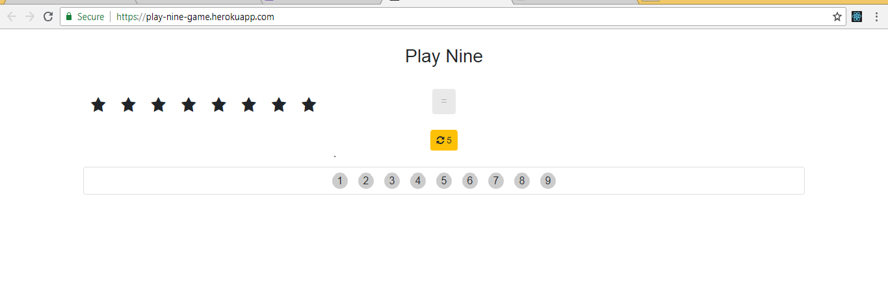
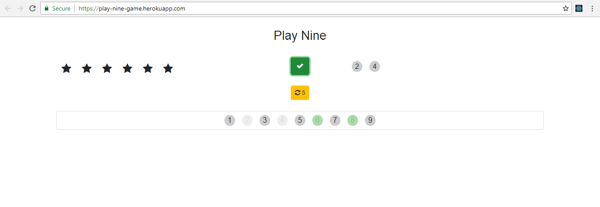
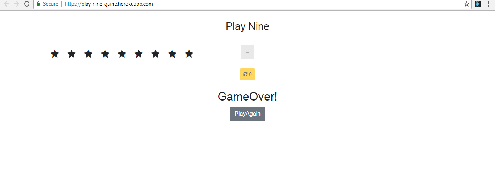

# Play Nine Game

This is the first project that I have created using React.

Play Nine Game is an interactive game build with React. Users will receive a random number of stars and they will have to select the number or the sum of numbers that are equivalent with the numbers of stars, then they will need to click the equal sign 2 times in order to confirm the respons. Users can also Redraw 5 times if they don't have an option of numbers that is equivalent to the numbers of stars. Users are going to win the game if the manage to mach all the numbers and the stars, if not they are going to lose the game.

## Screenshots

The game




You Won


You Lost



## To start the project

*  Install and start the app:
 
    - ```clone the repo```
    - ```cd into the folder```
    - ```run npm install```
    - ```npm start```


#### To see the game online: https://play-nine-game.herokuapp.com/


## Extra info

All the routes are created at the top level component `<App/>`.
I styled the app very simply using `Bootstrap`, as the styling was secondary in importance compared to the features.
This was a good learning opportunity as I created both my first project using React and also my first project on localhost3000, which I pushed on Heroku.